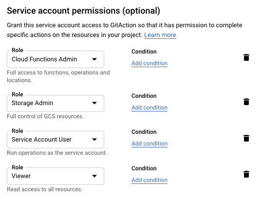

# GitHub OAuth App access token serverless solution 


Get GitHub OAuth Apps access token by using GCP Cloud Functions, because `The implicit grant type is not supported` 
from [GitHub official][authorizing-oauth-apps] currently 

A real use case of GitHub workflow that uses [GitHub Actions][actions] to deploy a
[GitHub OAuth App Node.js app](index.js) to [Cloud Functions][cloud-functions].

## Workflow description

For pushes to the `master` branch, this workflow will:

1.  Setup Node with selected version and running tests
    
1.  Download and configure the Google [Cloud SDK][sdk] with the provided credentials.

1.  Get all the files that Cloud Functions needed to be ready

1.  Deploy `local source` files to [Cloud Functions][cloud-functions].

## Setup

1.  Create a new Google Cloud Project (or select an existing project) and
    [enable the Cloud Functions APIs](https://console.cloud.google.com/flows/enableapi?apiid=cloudfunctions.googleapis.com).

1.  [Create a Google Cloud service account][create-sa] if one does not already
    exist.

1.  Add the the following [Cloud IAM roles][roles] to your service account:

    - `Cloud Functions Admin` - allows for the creation of new services

    - `Storage Admin` - allows to deploy Cloud Functions from Cloud Source repository (We are using upload file for this repo)

    - `Viewer` - allows for viewing the project

    - `Service Account User` -  required to deploy services to Cloud Run

    Note: You may need to create a custom IAM role with the most restrictive permissions for best practice.

    **Example:**

    

1.  [Create a JSON service account key][create-key] for the service account.

1.  Add the following secrets to your repository's secrets:

    - `RUN_PROJECT`: Google Cloud project ID

    - `RUN_SA_KEY`: `the content` of the service account JSON file
    
    - `GH_CLIENT_ID`: the GitHub OAuth App client id - [Create GitHub OAuth Apps][github-oauth-apps]
    
    - `GH_CLIENT_SECRET`: the GitHub OAuth App client secret - [Create GitHub OAuth Apps][github-oauth-apps]

## Run the workflow

1.  The workflow is watching on `push` event as showing below:

    ```shell script
    on:
      push:
        branches:
        - master
    ```

1.  Push to the `master` branch:

    ```shell script
    $ git push -u origin master
    ```

1.  View the GitHub Actions Workflow by selecting the `Actions` tab at the top
    of your repository on GitHub. Then click on the `Build and Deploy to Cloud
    Run` element to see the details.

## Development

1.  Install dependence

    ```shell script
    $ yarn install
    ```
    
1.  Run tests

    ```shell script
    $ yarn test
    ```

1.  Run Cloud Functions on your local environment:

    ```shell script
    # Create `.env` file to store your environment variables, template shows below
    CLIENT_ID=xxxxxxxx
    CLIENT_SECRET=xxxxxxxxxxxxxxxxxxxxxxxxxxxxxxxx
    
    $ yarn start
    ```
   
[actions]: https://help.github.com/en/categories/automating-your-workflow-with-github-actions
[cloud-functions]: https://cloud.google.com/functions
[create-sa]: https://cloud.google.com/iam/docs/creating-managing-service-accounts
[create-key]: https://cloud.google.com/iam/docs/creating-managing-service-account-keys
[sdk]: https://cloud.google.com/sdk
[secrets]: https://help.github.com/en/actions/automating-your-workflow-with-github-actions/creating-and-using-encrypted-secrets
[roles]: https://cloud.google.com/iam/docs/granting-roles-to-service-accounts#granting_access_to_a_service_account_for_a_resource
[github-oauth-apps]: https://developer.github.com/apps/building-oauth-apps/
[authorizing-oauth-apps]: https://developer.github.com/apps/building-oauth-apps/authorizing-oauth-apps/
